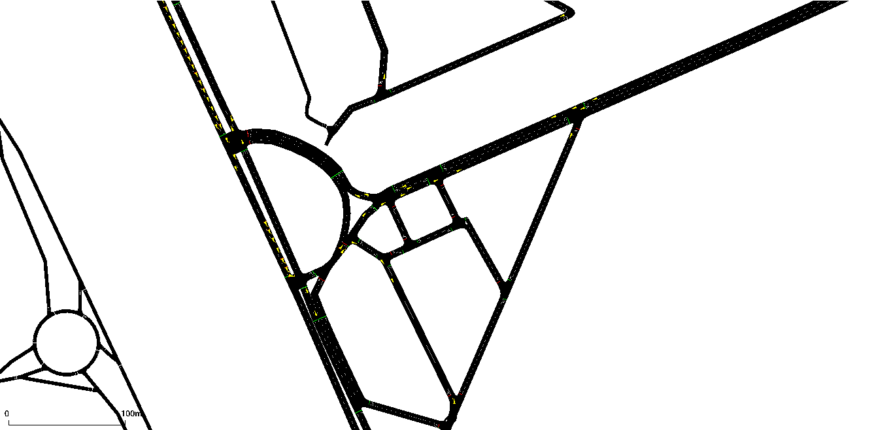

# Final Project
## 2021711877 정훈섭
## 2021711888 윤재구

***

## 프로젝트 목표
상습정체구역인 수원역 인근 도로의 교통량을 시뮬레이션.
신호등의 변환 주기(녹색 신호의 길이)를 RL기반 학습하여 최적의 케이스(동일 교통량환경에서의 차량들의 신호 대기 시간을 최소화)


추후 교통량 정보의 경우 공공데이터로부터 실제 데이터를 넣을 수 있을 것으로 예상.(현재, 수원역 근처 교통량 정보와 관련된 공공데이터는 없음.)

***

## 코드 실행 방법
하기 SUMO-RL Install(Install SUMO latest version, Install SUMO-RL) 진행 후, RUN 실행.

***

## 연관 플랫폼, 라이브러리

## SUMO-RL
SUMO-RL provides a simple interface to instantiate Reinforcement Learning environments with [SUMO](https://github.com/eclipse/sumo) for Traffic Signal Control. 

The main class [SumoEnvironment](https://github.com/LucasAlegre/sumo-rl/blob/master/environment/env.py) inherits [MultiAgentEnv](https://github.com/ray-project/ray/blob/master/python/ray/rllib/env/multi_agent_env.py) from [RLlib](https://github.com/ray-project/ray/tree/master/python/ray/rllib).  
If instantiated with parameter 'single-agent=True', it behaves like a regular [Gym Env](https://github.com/openai/gym/blob/master/gym/core.py) from [OpenAI](https://github.com/openai).  
[TrafficSignal](https://github.com/LucasAlegre/sumo-rl/blob/master/environment/traffic_signal.py) is responsible for retrieving information and actuating on traffic lights using [TraCI](https://sumo.dlr.de/wiki/TraCI) API.

Goals of this repository:
- Provide a simple interface to work with Reinforcement Learning for Traffic Signal Control using SUMO
- Support Multiagent RL
- Compatibility with gym.Env and popular RL libraries such as [stable-baselines3](https://github.com/DLR-RM/stable-baselines3) and [RLlib](https://docs.ray.io/en/master/rllib.html)
- Easy customisation: state and reward definitions are easily modifiable

## Install

### Install SUMO latest version:

```
sudo add-apt-repository ppa:sumo/stable
sudo apt-get update
sudo apt-get install sumo sumo-tools sumo-doc 
```
Don't forget to set SUMO_HOME variable (default sumo installation path is /usr/share/sumo)
```
echo 'export SUMO_HOME="/usr/share/sumo"' >> ~/.bashrc
source ~/.bashrc
```

### Install SUMO-RL

You can install using the latest (unreleased) version
```
git clone https://github.com/LucasAlegre/sumo-rl
cd sumo-rl
pip install -e .
```

### Install mandatory requirements via PIP
```
pip3 install stable_baselines3
```

***

### Git clone sumo-RL
```
cd ../
git clone https://github.com/hs85jeong/sumo-RL
git checkout submit
```

## 환경 설정 (별도로 실행할 필요 없음)
### 지도데이터 생성
상습정체구역인 수원역 근처의 지도를 이용



### 신호등 정보 생성
각 교차로마다 신호등 정보 생성

```
netedit
```

### 교통정보(시간에 따른 차량 및 차량 이동경로) 생성
```
python3 $SUMO_HOME/tools/randomTrips.py -n osm.net.xml -r osm.rou.xml -e 3600
```

***

## RUN
```
# Create directories as outputs/suwon, outputs/suwon_dqn first.
mkdir -p outputs/suwon outputs/suwon_dqn

# DQN
python3 experiments/dqn_suwon_failover.py
# A2C
python3 experiments/a2c_suwon_failover.py
```
